# Citi Bike

This challenge is completed as requirement of Data Analytics Boot Camp at University of Toronto.

In this assignment, I have created visualizations, dashboards and a story using Tableau for the [New York Citi Bike Program](https://en.wikipedia.org/wiki/Citi_Bike). CitiBike is the largest bike-sharing program in the United States. 

Since 2013, the Citi Bike program has implemented a robust infrastructure for collecting data on the program's utilization. Each month, bike data is collected, organized, and made public on the [Citi Bike Data](https://citibikenyc.com/system-data) webpage.

This Tableau dashboard is created with the purpose to establish a sophisticated reporting process. The set of visualizations are aimed to provide data reports to the city officials.

## Data Used

I have used the Jersey City data only for the full year 2022. The reason I did not use NYC data and could not analyze data over multiple year was because of Tableau limitations as the number of entries would have been higher than what is allowed on Tableau Public. I used Jupyter Notebook to concatonate the 12 data files for the year 2022 for Jersey City and stored the combined dataframe as a CSV file.

*NOTE: I have not added the combined CSV file as its size is 169 MB which exceeds the GitHub's file size limit.*

## Questions to Answer:

In this assignment, I aimed at aggregating the data found in the Citi Bike Trip History Logs and find two unexpected phenomena. The phenomena tha I have chosen are:

1. Which ride types are the most popular and how do they vary between members and casual riders?

2. What is the average trip duration and what are the trends for duration for different months, weekdays, and hours?

### Setp 1: Create Visualizations

In the first step, I created multiple visualizations to answer the two questions stated above.

***Rides***

The first step was to compute the total number of rides in 2022 for Jersey City which was 895,485.

The next visualization reviews the ride types and their count by Months. This shows that classic bikes are the most used types of bike and they remain dominant through out the year. Next are the electric bikes. And then the trips ondocked bikes are almost negligible.

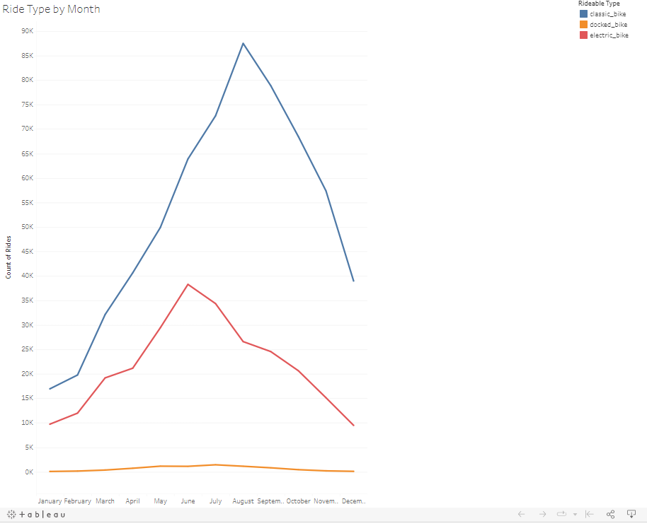

The next visualization also reviews the ride traffic by Months. This again shows that classic bikes are the most used types of bike and they remain dominant through out the year especially during the months of July, August and September.

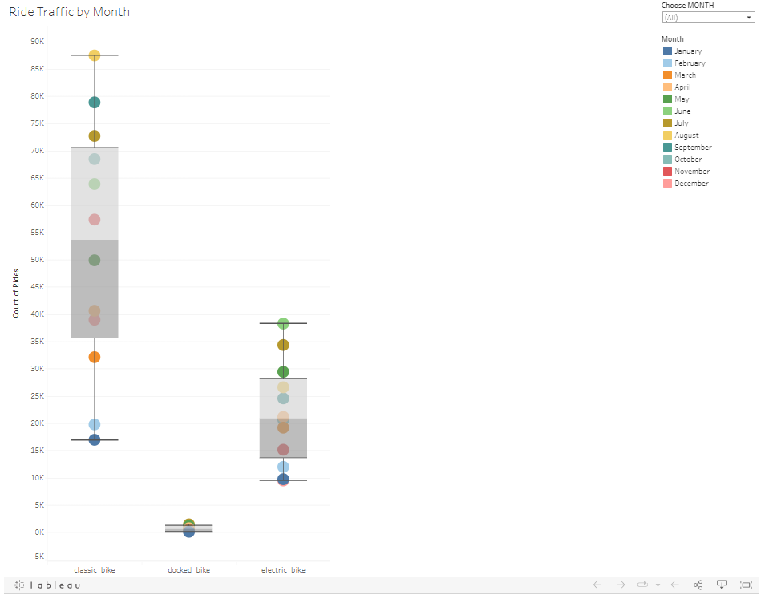

The next visualization compares the ride types used by members vs. casual riders. Classic bikes remain the most popular among both members and casual riders.

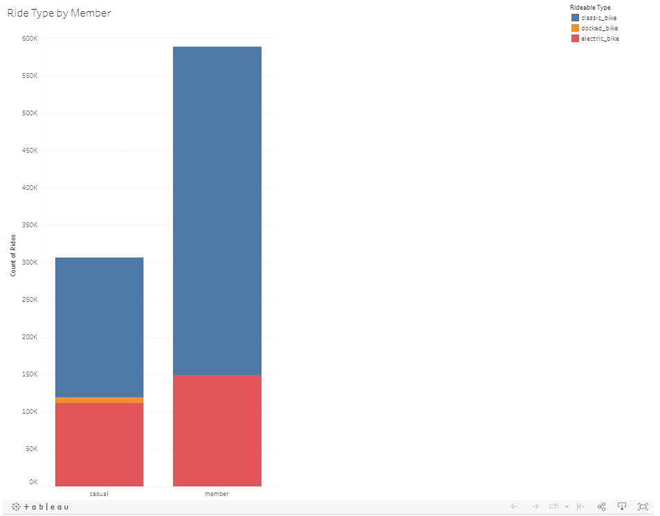

The next visualization compares the number of rides taken by members vs. casual riders over the year. Members clearly take more rides as compared to casual riders especially in the summer months.

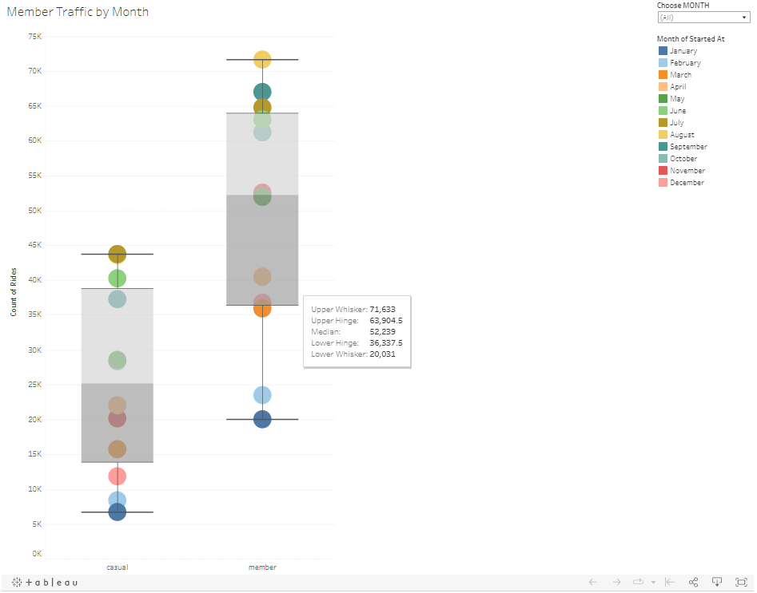

The next visualization compares the total rides taken by all riders across different months of the year. Summer and early Fall including June, July, August and September have the highest number of rides.

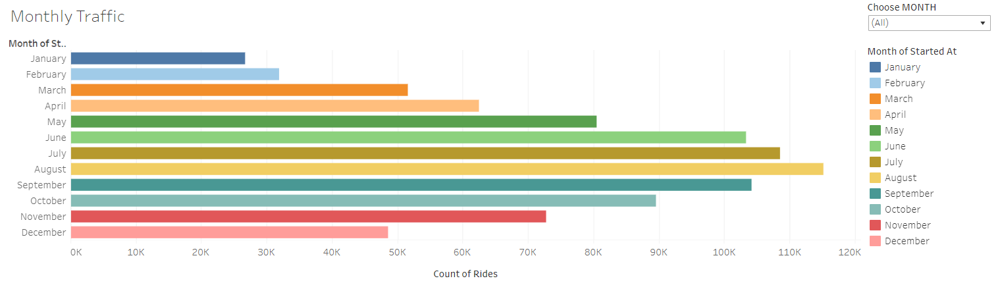

***Average Trip Duration***

The first step was to compute the average trip duration for 2022 in Jersey City which was 17.54 minutes.

The next visualization compares average trip duration with the number of rides. The most busiest stations (with highest ride counts) have an average trip duration of around 20 minutes. There are a couple of stations with outlier durations of over an hour.

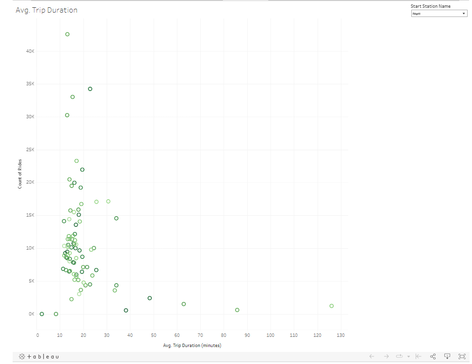

The next visualization compares the average trip durations across different months of the year. People tend to enjoy longer rides during the summer months of May, June and July. January is showing an anomaly because of a few outlier trips with longer trip durations.

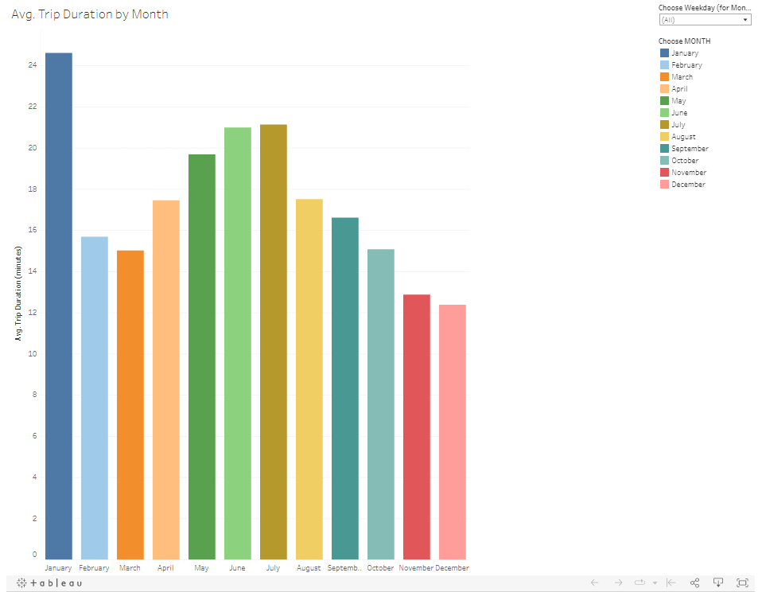

The next visualization again compares the average trip durations across different months but also puts details about the weekdays. Across all months, riders tend to enjoy longer rides over the weekends. In this chart, we can see the outlier trips taken during January.

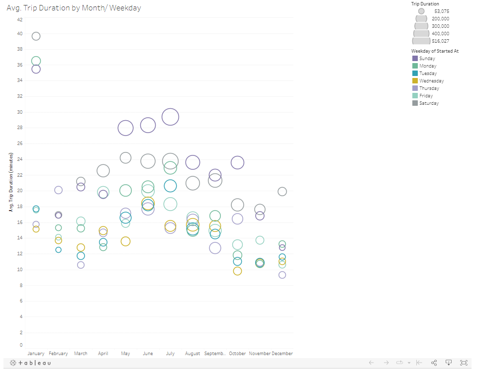

The next visualization compares the average duration of trips taken across different weekdays. Weekends clearly have higher trip durations across all months.

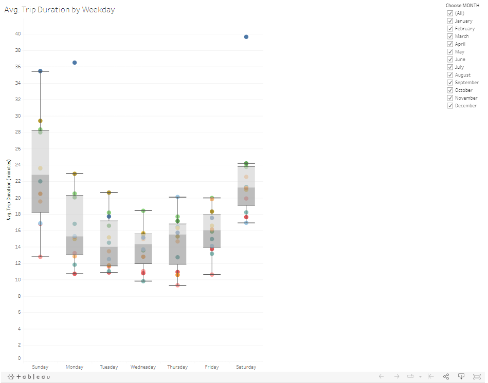

The next visualization compares the average trip duration taken over different days of the month. Although for 2022 overall, the 4th, 5th and 10th day of the month had the highest trip durations on average, however, this trend is different for each month.

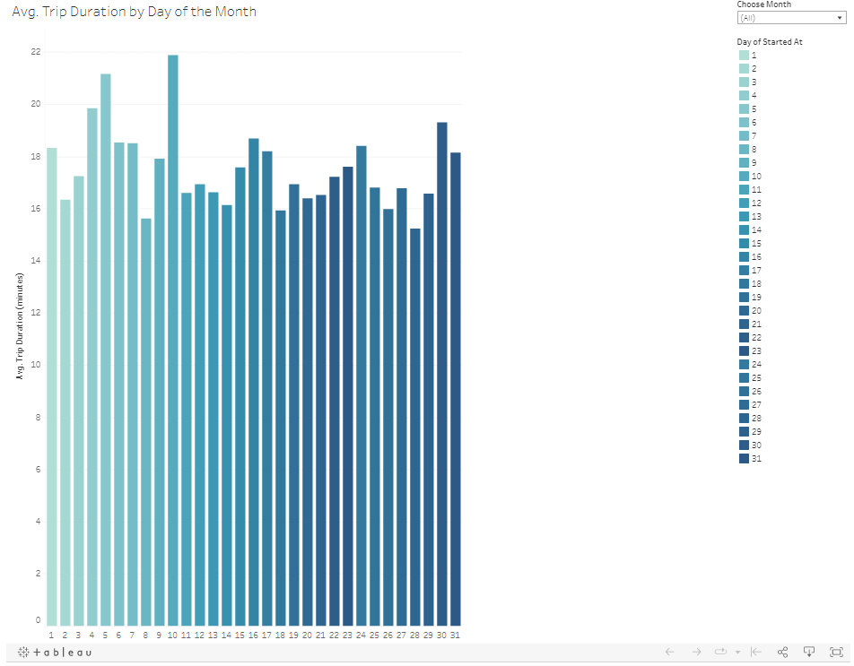

The next visualization creates a heatmap to show the average trip duration for different hours of the day. During weekdays, the commute hours of early morning (7-8 am) and evening (5-7 pm) have the highest average trip durations. The entire day during weekends from 10 am untill 7 pm have higher average trip durations.

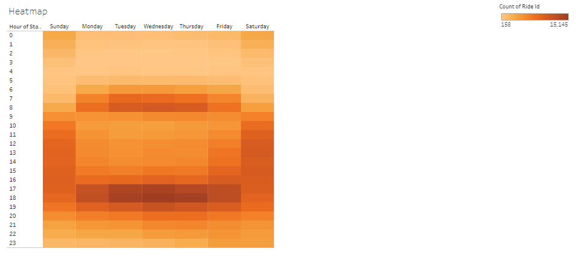

### Setp 2: Create Dashboards

In the second step, I created two dashboards to answer the two questions.

***Dashboard - Rides***

The dashboard for rides compares Ride types and their traffic across different months. The dashboard also attempts to compare the different ride types used among members vs. casual riders.

Following are key findings from this dashboard:

Ride Type:
- Classic bikes are the most popular rides throughout the year (75% members/ 61% casual riders).
- Electric bikes are also frequently used (25% members/ 36% casual riders).
- Docked bikes are used very less (only 2.5% of casual riders).

Ride Traffic:
- Winter months of December, January, February and March have lesser than average traffic for all ride types and among both member and casual riders.
- Summer and early Fall months of May, June, July, August and September have higher than average traffic for all ride types and among both member and casual riders.

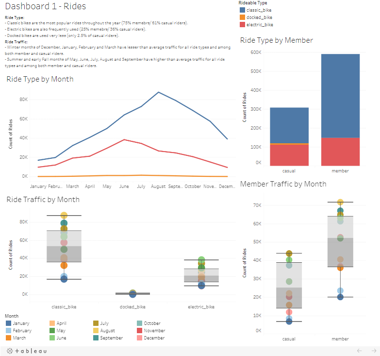

***Dashboard - Average Trip Duration***

The dashboard for average trip duration compares the length of the trips across different months of the year, weekdays, days of the month and across different hours of the day.

Following are key findings from this dashboard:

Average Trip Duration - Monthly Trend:
- The overall average trip duration for the year 2022 is 17.54 minutes.
- Summer months of May, June and July tend to have higher trip durations.
- The month of January shows the highest trip duration but this is attributable to three outlier trip durations recorded for January.

Average Trip Duration - Day of the Month Trend:
- Overall for 2022, the 4th, 5th and 10th day of the month recorded the highest average trip durations. However, this trend is different for each month of the year.

Average Trip Duration - Weekday Trend:
- Weekends are clearly the most popular days where riders tend to take trips for higher duration.

Average Trip Duration - Hourly Trend:
- During weekdays, riders tend to have longer trips during early morning hours (7-8 am) and evening hours (5-7 pm) which coincides with most commute to work hours.
- The average trip duration during the weekends is longer through out the day between 10 am to 7 pm.

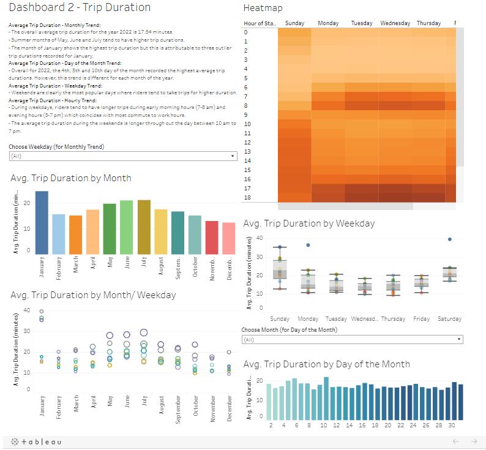

### Setp 3: Create a Map

In this step, I created a dynamic map which shows how each Start and End Station popularity changes over time (by adding a filter for Month). The map has Zip Code Boundaries and Zip Code Number data overlaid on the map. I have also added a layer for 2018 Median Household Income to the map. There are two maps created - one to show the Start Stations data and the second for the End Stations data.

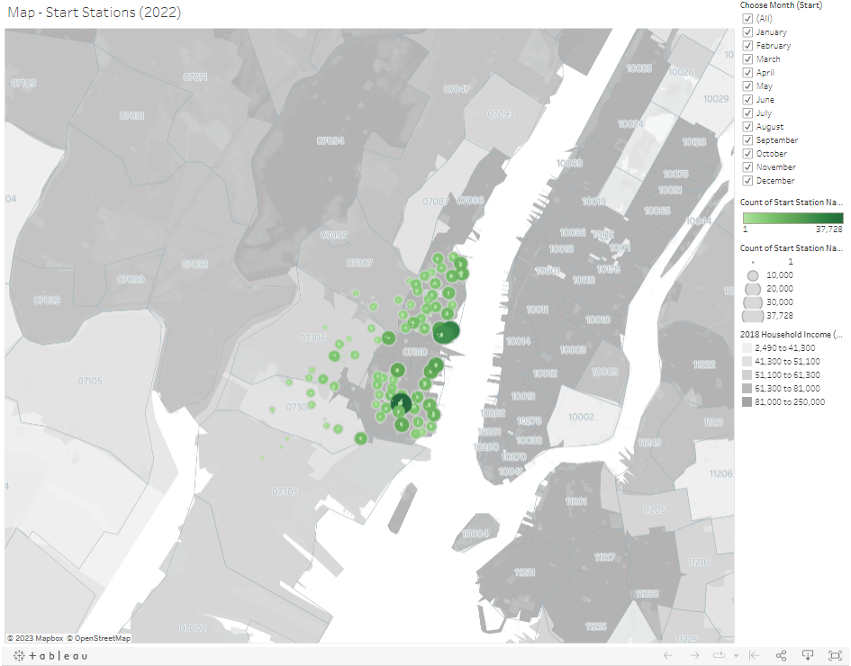

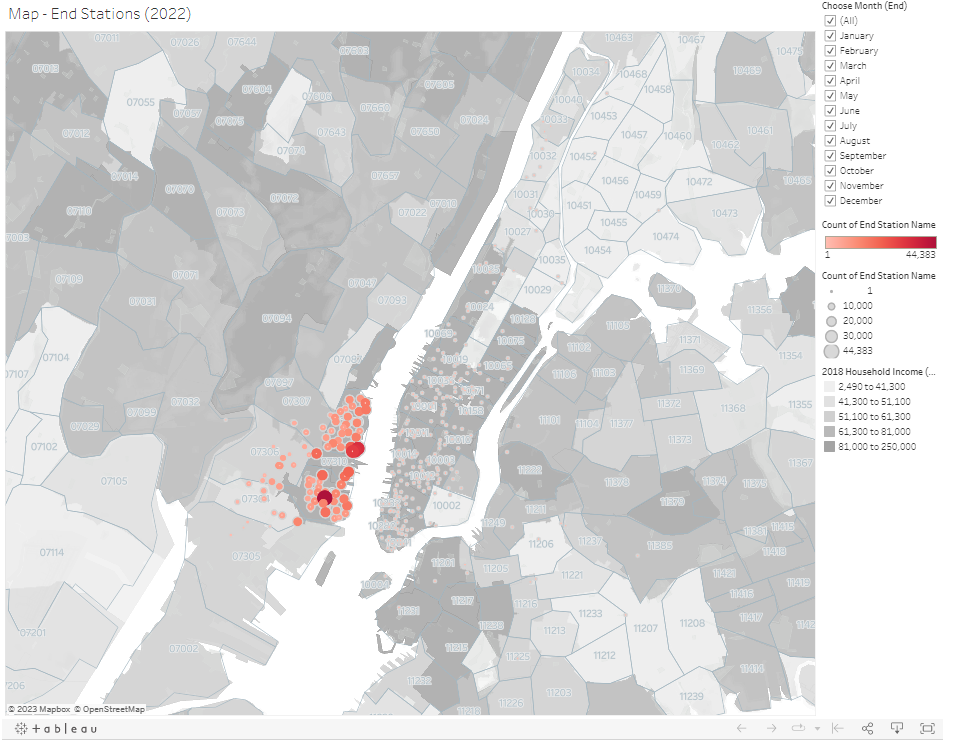

I have also created two bar charts to show the top 10 Stations used to Start and End the rides. The top 10 stations are the same for both start and end points.

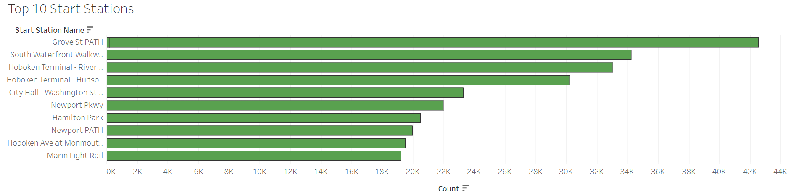

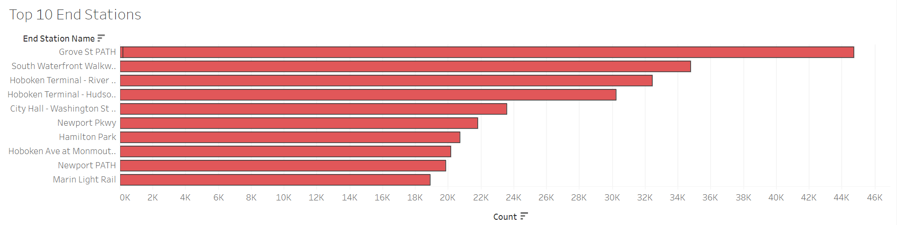

I then created a dashbaord displaying the two maps showing the Start and End Stations with filters added to analyze the most popular stations for each month.

Following are key findings from this dashboard:

The top 10 stations for starting and ending and trip are the same locations in Jersey City. The top 3 stations are:
1 - Grove St PATH (9.71% of total rides)
2 - South Waterfron Walkway - Sinatra Dr & 1 St (7.70% of total rides)
3 - Hoboken Terminal - River St & Hudson Pl (7.00% of total rides)

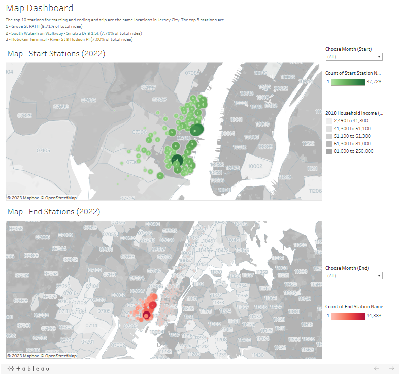

### Setp 4: Create a Story (Presentation)

Finally, I prepared a story on Tableau which is a presentation of all the visulizations created in the previous steps. The header of the story outlines a brief analysis derived out of the visualization.

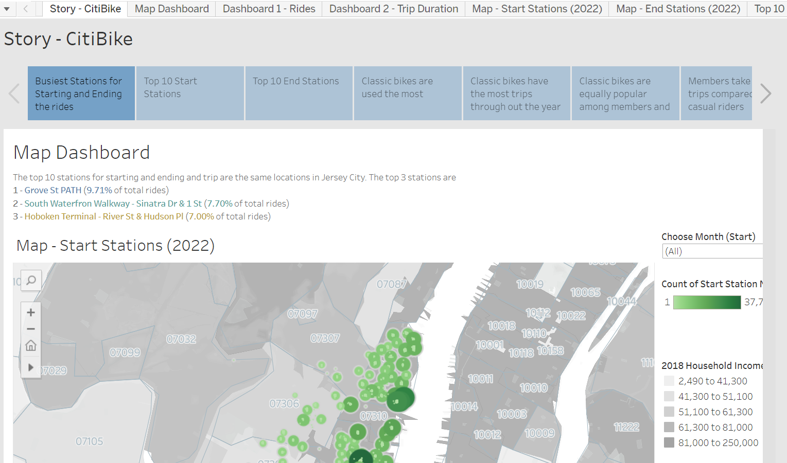
